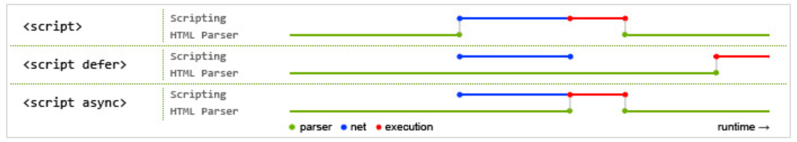

# JS基本类型

基本数据类型：Undefined, Null, Boolean, Number, String, Object

## typeof

typeof 操作符可能的返回值：

* "undefined"——如果这个值未定义
* "boolean"——如果这个值是布尔值
* "string"——如果这个值是字符串
* "number"——如果这个值是数值
* "object"——如果这个值是对象或null
* "function"——如果这个值是函数

所以可以用typeof操作符区分函数和对象。

## Undefined

在使用var声明变量但未对其初始化时，该变量的值就是undefined。

对于typeof操作符，未声明或已声明但未初始化的变量，返回的值都是"undefined"。

## Boolean

| 数据类型      | 转换为true        | 转换为false  |
| :-------- | -------------- | --------- |
| Boolean   | true           | false     |
| String    | 任何非空字符串        | ""(空字符串)  |
| Number    | 任何非零数字值(包括无穷大) | 0和NaN     |
| Object    | 任何对象           | null      |
| Undefined | -              | undefined |


## Number

* 如果数值超过了js数值范围，将会转换为Infinity(正无穷)和-Infinity(负无穷)

* 可以使用isFinity()函数判断数值是否超出范围，若在范围内，返回true

* NaN与任何值都不想等，包括它本身

* isNaN()函数会尝试将参数转换为数值，如果不能转换为数值，将返回true

  ```javascript
  isNaN(NaN)	// true
  isNaN(10)	// false
  isNaN("10")	// false，可以转为10
  isNaN("blue")	// true，不能转成数值
  isNaN(true)	// false，可以转为1
  ```

  ​

# 各类型深拷贝

```javascript
    function deepCopy(obj) {
      if(obj instanceof Date) {
        return new Date(obj.valueOf());
      }
      else if(obj instanceof RegExp) {
        return new RegExp(obj.valueOf());
      }
      else if(obj === null || obj === undefined || typeof obj != 'object') {
        return obj;
      }

      var newObj = (obj instanceof Array) ? [] : {};
      for(var k in obj) {
        if(!obj[k] != 'object') {
          newObj[k] = obj[k];
        }
        else {
          newObj[k] = deepCopy(obj[k]);
        }
      }
      return newObj;
    }
```

[代码详情](https://github.com/miraclezys/Notes/blob/master/code/deepCopy.html)


# JS继承

> [JS实现继承的几种方式](http://www.cnblogs.com/humin/p/4556820.html)

[代码详情](https://github.com/miraclezys/Notes/blob/master/code/inherit.html)

首先定义一个父类：

```javascript
function Animal(name) {
  this.name = name || 'Animal';
  this.sleep = function() {
    console.log(this.name + ' is sleeping!');
  }
}

Animal.prototype.eat = function(food) {
  console.log(this.name + ' is eating ' + food +'!');
}
```


## 原型链继承

核心：将父类的实例作为子类的原型

```javascript
// 原型链继承
function Cat() {}
Cat.prototype = new Animal();
Cat.prototype.constructor = Cat;
var cat = new Cat();

cat instanceof Animal;	// true
cat instanceof Cat; // true
```

缺点：

* 创建子类实例时，无法向父类构造函数传递参数
* 要为Cat类型的原型新增属性和方法，必须要在`new Animal()`之后新建
* 来自原型对象的引用属性是所有实例所共享的（下面会解释）
* 不能多继承


## 构造继承

核心：使用父类构造函数增强子类实例，等于将父类的实例属性复制到子类

```javascript
function Cat(name) {
  Animal.call(this, name);
  this.name = name || 'tom';
}

cat instanceof Animal;	// false
cat instanceof Cat; // true
```

优点：

* 创建子类时，可以给父类传递参数
* 解决了原型链继承中子类共享父类引入属性的问题
* 可以实现多继承(可以call多个父类对象)

缺点：

* 实例是子类的实例，不是父类的实例，子类的实例的原型链上不存在父类
* 实例只是继承了父类的属性和方法，没有继承父类原型的属性和方法
* 每个子类都产生父类的属性和方法的副本，影响性能


## 组合继承

```javascript
function Cat(name) {
  Animal.call(this);
  this.name = name || 'Tom';
}

Cat.prototype = new Animal();
Cat.prototype.constructor = Cat;

cat instanceof Animal;	// true
cat instanceof Cat; // true
```

优点：

* 实例是子类的实例，也是父类的实例
* 不存在引用属性共享的问题
* 可以传参

缺点：

* 调用了两次父类构造函数（子类实例将子类原型上的相同属性覆盖了）


## 原型式继承

```javascript
function object(o) {
  function F(){};
  F.prototype = o;
  return new F();
}

var animal = new Animal();
var cat = object(animal);	// 核心
cat.color = 'black';
```

原型式继承必须有一个对象作为另一个对象的基础。如果有这么一个对象，可以把它传递给object()函数，然后再根据具体需求对得到的对象加以修改。

可以使用Object.create()替代上面的object()函数：

```javascript
var animal = new Animal();
var cat = Object.create(animal);	// 核心
cat.color = 'black';
```


## 寄生式继承

```javascript
function createAnother(original) {
  var clone = object(original);
  clone.sayHi = function() {
    console.log('hi');
  };
  return clone;
}
```

寄生式继承是与原型式继承紧密相连的一种思路。寄生式继承是创建一个仅用于封装继承过程的函数，该函数内部以某种方式来增强对象，最后再像真地使它做了所有工作一样返回对象。


## 寄生组合继承

```javascript
function Cat(name) {
  Animal.call(this);
  this.name = name || 'Tom';
}

(function() {
  var Super = function(){};
  Super.prototype = Animal.prototype;
  Cat.prototype = new Super();
  Cat.prototype.constructor = Cat;
})();

cat instanceof Animal;	// true
cat instanceof Cat; // true
```

优点：完美

缺点：实现较为复杂


## 原型链继承的缺点(共享属性)


```javascript
// 父类
function Animal(name) {
  this.name = name || 'Animal';
  this.color = ['red'];
  this.sleep = function() {
    console.log(this.name + ' is sleeping!');
  }
}

Animal.prototype.eat = function(food) {
  console.log(this.name + ' is eating ' + food +'!');
}

// 原型链继承
function Cat() {}
Cat.prototype = new Animal();
Cat.prototype.constructor = Cat;

var cat = new Cat('cat');
console.log(cat.color); // red
cat.color.push('yellow');
console.log(cat.color);	// red, yellow
var cat2 = new Cat();
console.log(cat2.color);	// red, yellow
```

从上述代码可以看到，color属性被修改了。如果cat.color = ['black']，那么cat2的color属性就不会被修改。


# 作用域链

每个函数都有自己的执行环境，当执行流进入一个函数时，函数的环境就会被推入一个环境栈中。代码执行完后，栈将其环境弹出，把控制权返回之前的执行环境。

当代码在一个环境执行时，就会创建一个与之关联的作用域链。作用域链的前端，是当前执行的代码所在环境的变量对象（环境中定义的所有变量和函数）。如果当前的环境是一个函数，那么作用域链的前端就是定义这个函数参数和局部变量的对象，作用域链中下一个变量对象来自包含（外部）环境，而再下一个变量对象则来自下一个包含环境，以此类推，最后是全局执行环境的变量对象。

所以在执行环境中查找标识符（变量）时，会先从作用域链的顶端查找，接着逐渐往上级查询，直到查找到为止。

> 执行环境：定义了变量或函数有权访问的数据
>
> 作用域链：指向变量对象的指针列表


# 闭包

闭包是指有权访问另一个函数作用域的变量的函数。

```javascript
function add(a) {
  return function(b) {
    return a + b;
  }
}
```

全局环境的变量对象始终存在，而add()函数这样的局部环境的变量对象，只有在函数执行时才存在。在创建add()函数时，会创建一个预先包含全局变量对象的作用域链，这个作用域链保存在内部的([Scope])属性中。当调用add()函数时，会为函数创建一个执行环境，然后通过赋值函数的([Scope])属性中的对象构建起执行环境的作用域链。接着会有一个活动对象被创建并推入作用域链的前端。所以对于add()函数而言，作用域链包含两个变量对象：本地活动对象和全局变量对象。

add()函数的内部函数的作用域链因为包含add()函数的作用域，所以能够访问add()函数的变量。

> 由于闭包会携带包含它的函数的作用域，所以会比其他函数占用更多的内存，谨慎使用闭包。

## this对象

每个函数在调用时会自动取得两个特殊的变量：this和arguments。内部函数在搜索这两个变量时，只会搜索到活动对象为止，不能直接访问这两个变量。所以内部函数的this通常为window。如果想使用外部函数的这两个变量，可以先使用一个变量保存下来即可。

## 内存泄漏

```javascript
var a = add('Amy');
var result = a('Bob');
```

当add()函数执行完毕后，它的活动对象不会被销毁，因为其内部函数的作用域链仍然在引用这个活动对象。换句话说，add()函数返回后，其执行环境的作用域链会被销毁，但它的活动对象仍然在内存中，直到内部函数被销毁，add()函数的活动对象才能被销毁。

```javascript
var a = add('Amy');
var result = a('Bob');

// 解除对内部函数的引用（以便释放内存）
a = null;
```

通过将a设置为null，解除该函数的引用，等于通知垃圾回收例程将其清除。随着匿名函数的作用域链被销毁，其他的作用域链（除了全局函数）也会被安全的销毁。

## 应用

闭包通常用来创建内部变量，使得这些变量不能被外部随意修改，同时又可以通过指定的函数接口来操作。 

* 可以读取函数内部的变量
* 让这些变量的值始终保持在内存中

```javascript
function foo() {
	var b = 1;
	return function() {
		b += 1;
		return b;
    }
}

var a = foo();
a();	// 2
a();	// 3;
```


# 原型链

基本思想：利用原型让一个引用类型继承另一个引用类型的属性和方法。

每个构造函数都有一个原型对象，原型对象都包含一个指向构造函数的指针，而实例都包含一个指向原型对象的内部指针。假如让原型对象等于另一个类型的实例，那么此时的原型对象将包含一个指向另一个原型的指针，假如另一个原型又是另一个类型的实例，一次类推，就构成了原型链。


# Ajax

### 创建XHR对象

```javascript
function makeRequest(url) {
    var httpRequest;
    if(window.XMLHttpRequest) {
      httpRequest = new XMLHttpRequest();
      if(httpRequest.overrideMimeType) {  // 兼容部分版本的Mozilla浏览器
        httpRequest.overrideMimeType('text/xml');
      }
    }
    else if(window.ActiveXObject) { // IE
      try {
        httpRequest = new ActiveXObject("Msxml.XMLHttp"); // 较高版本
      }
      catch(e) {
        try {
          httpRequest = new ActiveXObject("Microsoft.XMLHttp");
        }
        catch(e) {}
      }
    }
    else {
      console.log("No XHR object available.");
    }

    httpRequest.onreadystatechange = function() {buttonClick(httpRequest)};
    httpRequest.open("GET", url, true);
    httpRequest.send(null);
  }

  function alertContents(httpRequest) {
    if(httpRequest.readyState == 4) {
      if(httpRequest.status == 200) {
        alert(httpRequest.responseText);
      }
      else {
        console.log("There was a problem with the request.");
      }
    }
  }
```

- open()方法：接收3个参数
  - 发送请求的类型：注意大写，遵循HTTP标准，否则有些浏览器（如 Firefox）不会处理这些请求。


- 请求的URL：只能向同一个域中使用相同端口和协议的URL发送请求，否则会引发安全错误。
- 是否异步发送请求的布尔值

  调用open()方法不会真正发送请求，只是启动一个请求以备发送。

- send()方法：只接受一个参数，即要作为请求主体发送的数据。如果不需要通过请求主体发送数据，则必须传入null，因为这对于一些浏览器来说是必须的。

- onreadystatechange函数：

  XHR对象的readyState属性表示请求/响应阶段的当前状态：

  - 0：未初始化。尚未调用open()方法
  - 1：启动。已调用open()方法，尚未调用send()方法
  - 2：发送。已调用send()方法，尚未接收到响应
  - 3：接收。已接收到部分响应数据
  - 4：完成。已接收到全部的响应数据，且可以在客户端上使用

  只要readyState的值从一个值变为另一个值，就会触发一次readystatechange事件，可以使用这一事件检测每次状态变化后readyState的值。

  - responseText：作为响应主体被返回的文本
  - responseXML：如果响应的内容类型是“text/xml”或“application/xml”，这个属性将保存响应数据的XML DOM文档。

- HTTP头部信息

  - 设置HTTP头部：setRequestHeader()方法接收两个参数：头部字段的名称和头部字段的值。

    ```javascript
    httpRequest.open("GET", url, true);
    httpRequest.setRequestHeader("MyHeader", "MyValue");
    httpRequest.send(null);
    ```

    要成功发送请求头部信息，必须在调用open()方法之后且调用send()方法之前调用setRequestHeader()

- GET请求

  有时候我们需要在请求的URL末尾添加查询字符串，此时需要注意查询字符串中每个参数都需要使用encodeURIComponent()进行编码，可以实现一个函数实现这一功能：

  ```javascript
  function addURLParam(url, name, value) {
    url += (url.indexOf("?") == -1 ? "?" : "&");
    url += encodeURIComponent(name) + "=" + encodeURIComponent(value);
    return url;
  }
  ```

  注意URL的格式哦，比如一个正确的URL：

  ```
  example.php?name1=value1&name2=value2
  ```

- POST请求

  使用XHR模拟表单提交：首先需要设置Content-Type头部信息设置为application/x-www-form-urlencoded，接着需要将表单中的数据进行序列化并作为参数传入send()方法中。

  序列化之后的数据：

  ```
  foo=bar&baz=The+first+line
  ```

## XMLHttpRequest Level 2

注意兼容性

### FormData

FormData可以通过JavaScript用一些键值对来模拟一系列表单控件，即创建与表单格式相同的数据（用于提供XHR传输）。

```javascript
var data = new FormData();
data.append("name", "Nicholas");
httpRequest.send(data);

//也可以这样
var formElement = document.querySelector("form");
request.send(new FormData(formElement));
```

而且使用FormData不必明确在XHR对象上设置请求头部。

### timeout

timeout属性表示请求在等待响应多少毫秒之后会终止。当浏览器在规定时间内没有接收到响应，会触发timeout事件，进而调用ontimeout事件处理程序。

```javascript
httpRequest.open("GET", url, true);
httpRequest.timeout = 1000;	// 1s
httpRequest.ontimeout = function() {
  alert("Request didi not return in a second");
}
httpRequest.send(null);
```

### overrideMimeType()

overrideMimeType()方法用于重写XHR响应的MIME类型，比如想要将响应的数据当做XML处理而非纯文本：

```javascript
httpRequest.open("GET", url, true);
httpRequest.overrideMimeType("text/xml");
httpRequest.send(null);
```

### 进度事件

- loadstart：在接收响应数据的第一个字节时触发。只要浏览器接收到服务器响应，就会触发load事件，所以必须要先检查status属性才能确定数据是否可用。

- progress：在接收响应期间持续不断地触发，包含三个额外的属性，lengthComputable表示进度信息是否可用，position表示已接收的字节数，totalSize表示根据Content-Length响应头部确定的预期字节数

- error：在请求发生错误时触发

- abort：在因为调用abort()方法而终止连接时触发

- load：在接收到完整响应数据时触发

  ```javascript
  httpRequest.onload = function() {
    if(httpRequest.status == 200) {
    	alert(httpRequest.responseText);
    }
    else {
    	console.log("There was a problem with the request.");
    }
  }
  ```

- loadend：在通信完成或者触发error、abort或load事件后触发

### 完整代码

```html
<!DOCTYPE html>
<html>
<head>
  <meta charset="UTF-8" />
  <title>Hello World</title>
</head>
<body>
  <p class="root">还在<i>加载中</i>i啦</p>
  <button class="button">点击一下</button>
  <a href="http://www.baidu.com" target="_top">下载</a>
<script>
  function makeRequest(url) {
    var httpRequest;
    if(window.XMLHttpRequest) {
      httpRequest = new XMLHttpRequest();
      if(httpRequest.overrideMimeType) {  // 兼容部分版本的Mozilla浏览器
        httpRequest.overrideMimeType('text/xml');
      }
    }
    else if(window.ActiveXObject) { // IE
      try {
        httpRequest = new ActiveXObject("Msxml.XMLHttp"); // 较高版本
      }
      catch(e) {
        try {
          httpRequest = new ActiveXObject("Microsoft.XMLHttp");
        }
        catch(e) {}
      }
    }
    else {
      console.log("No XHR object available.");
    }

    httpRequest.onreadystatechange = function() {buttonClick(httpRequest)};
    httpRequest.open('GET', 'https://github.com/miraclezys/JavaScript30/blob/master/06%20-%20Type%20Ahead/index-ME.json', true);
    httpRequest.send(null);

  }

  function buttonClick(httpRequest) {
    if(httpRequest.readyState == 4) {
      if(httpRequest.status == 200) {
        console.log(httpRequest.responseText);
        console.log(httpRequest.getAllResponseHeaders());
      }
      else {
        console.log("There was a problem with the request.");
      }
    }
  }

  var button = document.querySelector('.button');
  button.addEventListener('click', makeRequest);
</script>
</body>
</html>
```


# defer和async

> [defer和async的区别](https://segmentfault.com/q/1010000000640869)
>
> [浅谈script标签的defer和async](https://segmentfault.com/a/1190000006778717)



* defer是指浏览器会立即异步下载js文件，但是当整个页面解析完毕后再运行。通常执行顺序是按照延迟脚本的先后顺序执行，且该脚本执行会先于DOMContentLoaded事件（但是不一定）。

  该属性只适合外部脚本文件。

* async是指浏览器会立即异步下载js文件，当文件下载完时，渲染引擎就会中断渲染，执行这个脚本以后，再继续渲染。哪个脚本先下载完毕，哪个脚本先执行。异步脚本一定会在页面的load事件前执行，但可能会在DOMContentLoaded事件触发之前或之后执行。

上图中没有上述两种属性时，js文件不是异步请求的，但是在目前的chrome中，各种资源都是进行异步请求的。

# MV*

> [界面之下：还原真实的MV*模式——戴嘉华](https://github.com/livoras/blog/issues/11)

## MVM

- 视图（View）：用户界面。
- 控制器（Controller）：业务逻辑
- 模型（Model）：数据保存


用户的对View操作以后，View捕获到这个操作，会把处理的权利交移给Controller（Pass calls）；Controller会对来自View数据进行预处理、决定调用哪个Model的接口；然后由Model执行相关的业务逻辑；当Model变更了以后，会通过观察者模式（Observer Pattern）通知View；View通过观察者模式收到Model变更的消息以后，会向Model请求最新的数据，然后重新更新界面。

看似没有什么特别的地方，但是由几个需要特别关注的关键点：

1. View是把控制权交移给Controller，Controller执行应用程序相关的应用逻辑（对来自View数据进行预处理、决定调用哪个Model的接口等等）。
2. Controller操作Model，Model执行业务逻辑对数据进行处理。但不会直接操作View，可以说它是对View无知的。
3. View和Model的同步消息是通过**观察者模式**进行，而同步操作是由View自己请求Model的数据然后对视图进行更新。

### MVC的优缺点

优点：

1. 把业务逻辑和展示逻辑分离，模块化程度高。且当应用逻辑需要变更的时候，不需要变更业务逻辑和展示逻辑，只需要Controller换成另外一个Controller就行了（Swappable Controller）。
2. 观察者模式可以做到多视图同时更新。

缺点：

1. Controller测试困难。因为视图同步操作是由View自己执行，而View只能在有UI的环境下运行。在没有UI环境下对Controller进行单元测试的时候，应用逻辑正确性是无法验证的：Model更新的时候，无法对View的更新操作进行断言。
2. View无法组件化。View是强依赖特定的Model的，如果需要把这个View抽出来作为一个另外一个应用程序可复用的组件就困难了。因为不同程序的的Domain Model是不一样的


## MVP


和MVC模式一样，用户对View的操作都会从View交移给Presenter。Presenter会执行相应的应用程序逻辑，并且对Model进行相应的操作；而这时候Model执行完业务逻辑以后，也是通过观察者模式把自己变更的消息传递出去，但是是传给Presenter而不是View。Presenter获取到Model变更的消息以后，**通过View提供的接口更新界面**。

关键点：

1. View不再负责同步的逻辑，而是由Presenter负责。Presenter中既有应用程序逻辑也有同步逻辑。
2. View需要提供操作界面的接口给Presenter进行调用。（关键）

对比在MVC中，Controller是不能操作View的，View也没有提供相应的接口；而在MVP当中，Presenter可以操作View，View需要提供一组对界面操作的接口给Presenter进行调用；Model仍然通过事件广播自己的变更，但由Presenter监听而不是View。

### MVP（Passive View）的优缺点

优点：

1. 便于测试。Presenter对View是通过接口进行，在对Presenter进行不依赖UI环境的单元测试的时候。可以通过Mock一个View对象，这个对象只需要实现了View的接口即可。然后依赖注入到Presenter中，单元测试的时候就可以完整的测试Presenter应用逻辑的正确性。这里根据上面的例子给出了Presenter的[单元测试样例](https://github.com/livoras/MVW-demos/tree/master/test/mvp)。
2. View可以进行组件化。在MVP当中，View不依赖Model。这样就可以让View从特定的业务场景中脱离出来，可以说View可以做到对业务完全无知。它只需要提供一系列接口提供给上层操作。这样就可以做到高度可复用的View组件。

缺点：

1. Presenter中除了应用逻辑以外，还有大量的View->Model，Model->View的手动同步逻辑，造成Presenter比较笨重，维护起来会比较困难。

## MVVM

MVVM代表的是Model-View-ViewModel，这里需要解释一下什么是ViewModel。ViewModel的含义就是 "Model of View"，视图的模型。它的含义包含了领域模型（Domain Model）和视图的状态（State）。 在图形界面应用程序当中，界面所提供的信息可能不仅仅包含应用程序的领域模型。还可能包含一些领域模型不包含的视图状态，例如电子表格程序上需要显示当前排序的状态是顺序的还是逆序的，而这是Domain Model所不包含的，但也是需要显示的信息。

可以简单把ViewModel理解为页面上所显示内容的数据抽象，和Domain Model不一样，ViewModel更适合用来描述View。


MVVM的调用关系和MVP一样。但是，在ViewModel当中会有一个叫Binder，或者是Data-binding engine的东西。以前全部由Presenter负责的View和Model之间数据同步操作交由给Binder处理。你只需要在View的模版语法当中，指令式地声明View上的显示的内容是和Model的哪一块数据绑定的。当ViewModel对进行Model更新的时候，Binder会自动把数据更新到View上去，当用户对View进行操作（例如表单输入），Binder也会自动把数据更新到Model上去。这种方式称为：Two-way data-binding，双向数据绑定。可以简单而不恰当地理解为一个模版引擎，但是会根据数据变更实时渲染。

也就是说，MVVM把View和Model的同步逻辑自动化了。以前Presenter负责的View和Model同步不再手动地进行操作，而是交由框架所提供的Binder进行负责。只需要告诉Binder，View显示的数据对应的是Model哪一部分即可。

### MVVM的优缺点

优点：

1. 提高可维护性。解决了MVP大量的手动View和Model同步的问题，提供双向绑定机制。提高了代码的可维护性。
2. 简化测试。因为同步逻辑是交由Binder做的，View跟着Model同时变更，所以只需要保证Model的正确性，View就正确。大大减少了对View同步更新的测试。

缺点：

1. 过于简单的图形界面不适用，或说牛刀杀鸡。
2. 对于大型的图形应用程序，视图状态较多，ViewModel的构建和维护的成本都会比较高。
3. 数据绑定的声明是指令式地写在View的模版当中的，这些内容是没办法去打断点debug的。


# 同源策略


# 严格模式

> [Javascript 严格模式详解](http://www.ruanyifeng.com/blog/2013/01/javascript_strict_mode.html)

设立严格模式的目的：

* 消除Javascript语法的一些不合理、不严谨之处，减少一些怪异行为;
* 消除代码运行的一些不安全之处，保证代码运行的安全；
* 提高编译器效率，增加运行速度；
* 为未来新版本的Javascript做好铺垫。

## 如何调用

* 将"use strict"放在脚本的第一行，则整个脚本将以严格模式运行。如果这行脚本不在第一行，将无效，将以正常模式运行。

  ```html
  <script>
  	"use strict";
  	console.log("严格模式");
  </script>
  <script>
  	console.log("正常模式");
  </script>
  ```

  比如一个网页有两段JavaScript代码，前一个\<script>标签是在严格模式下运行，后一个不是。

* 将"use strict"放在函数的第一行，那么整个函数将以严格模式运行。

  ```javascript
  function foo() {
    "use strict";
    console.log("严格模式");
  }

  function nofoo() {
    console.log("正常模式");
  }
  ```

* 第一种方法不利于文件的合并，推荐采用以下的形式：

  ```javascript
  (function() {
    "use strict";
    // your code
  })();
  ```

## 语法

* 全局变量显示声明

  严格模式要求，所有变量都需要显示声明。而在正常模式下，如果一个变量没有声明就赋值，默认是全局变量。

  ```javascript
  "use strict";

  v = 1; // 报错，v未声明

  for(i = 0; i < 2; i++) { // 报错，i未声明
  }
  ```

* 静态绑定

  JavaScript语言是允许“动态绑定”的，即某些属性和方法到底属于哪个对象，不是在编译时确定的，而是在运行时确定的。严格模式对“动态绑定”做了一些现实，在某些情况下只允许静态绑定。即属性和方法到底属于哪个对象，在编译时就需要确定。这有利于编译效率的提高，同时使得代码更易于阅读，减少出错。

  * 禁止使用with语句

    因为with语句在编译时无法确定，属性到底属于哪个对象

    ```javascript
    "use strict";
    var obj = {a: 1};
    with(obj) {	// 语法错误
      var b = a;
    }
    ```

  * eval作用域

    正常模式下，JavaScript语言有两种变量作用域：全局作用域和函数作用域，而eval语句的作用域取决于它处于全局作用域还是函数作用域。

    而在严格模式下，eval语句有其自己的作用域，不能产生全局变量，它产生的变量只能用于eval内部。

    ```javascript
    "use strict";
    var x = 2;
    console.info(eval("var x = 5; x")); // 5
    console.info(x); // 2
    ```

* 增强的安全措施

  * 禁止this关键字指向全局对象

    ```javascript
    function f(){
    	return !this;
    } 
    // 返回false，因为"this"指向全局对象，"!this"就是false

    function f(){ 
    	"use strict";
    	return !this;
    } 
    // 返回true，因为严格模式下，this的值为undefined，所以"!this"为true。
    ```

    因此在使用构造函数时，如果忘了加new，this不再指向全局对象，而是为undefined，就会报错

    ```javascript
    function f(){
    	"use strict";
    	this.a = 1;
    };

    f();// 报错，this未定义
    ```

  * 禁止在函数内部遍历调用栈

    ```javascript
    function f1(){
        "use strict";
        f1.caller; // 报错
        f1.arguments; // 报错
    }

    f1();
    ```

* 禁止删除变量

  严格模式下，禁止删除变量。只有在configurable设置为true时，才能被删除。

  ```javascript
  "use strict";
  var x;
  delete x; // 语法错误

  var o = Object.create(null, {'x': {
  	value: 1,
  	configurable: true
  }});

  delete o.x; // 删除成功
  ```

* 显示报错

  * 在正常模式下，对一个对象的只读属性赋值，不会报错，只会默默的失败。在严格模式下，就会报错。

    ```javascript
    "use strict";

    var o = {};
    Object.defineProperty(o, "v", { value: 1, writable: false });
    o.v = 2; // 报错
    ```

  * 严格模式下，对一个使用getter方法读取的属性赋值，将会报错。

    ```javascript
    "use strict";

    var o = {
      get v() {return 1;}
    }
    o.v = 2;	// 报错
    ```

  * 严格模式下，对禁止扩展的对象添加新属性，将会报错。

    ```javascript
    "use strict";

    var o = {v: 1};
    Object.preventExtensions(o);
    o.a = 2;	// 报错
    ```

  * 严格模式下，删除一个不可删除的对象，将回报错

    ```javascript
    "use strict";
    delete Object.prototype;
    ```

* 重名错误

  * 对象不能有重名的属性

    在正常模式下，如果对象有多个重名的属性，最后赋值的属性将会覆盖前面的值。严格模式下，这属于语法错误。

    ```javascript
    "use strict";

    var o = {
    	p: 1,
    	p: 2
    }; // 语法错误
    ```

    > 奇怪的是，在chrome下没有报错

  * 函数不能有重名的参数

    在正常模式下，函数中重名的参数可以使用arguments[i]获取。在严格模式下，会报错。

    ```javascript
    "use strict";

    function f(a, a, b) { // 语法错误
    	return ;
    }
    ```

* 禁止八进制表示法

  在正常模式下，整数的第一位如果是0，表示这是八进制，如0100等于十进制的64。在严格模式下，如果整数第一位为0，将会报错。

  ```javascript
  "use strict";
  var a = 0100;	// 报错
  ```

* arguments对象的限制

  arguments是函数的参数对象，严格模式对其做出了一些限制

  * 不允许对arguments赋值

    ```javascript
    "use strict";

    arguments++; // 语法错误

    var obj = { set p(arguments) { } }; // 语法错误

    try { } catch (arguments) { } // 语法错误

    function arguments() { } // 语法错误

    var f = new Function("arguments", "'use strict'; return 17;"); // 语法错误
    ```

  * arguments不再追踪参数的变化

    ```javascript
    // 正常模式
    function foo(a) {
    	a = 2;
    	console.log(a, arguments[0]);
    }
    foo(1); // 2, 2
        
    // 严格模式
    "use strict";

    function foo(a) {
    	a = 2;
    	console.log(a, arguments[0]);
    }
    foo(1);	// 2, 1
    ```

  * 禁止使用arguments.callee

    这意味着，无法在匿名函数下调用其自身

    ```javascript
    "use strict";

    var f = function() { return arguments.callee; };
    f(); // 报错
    ```

* 函数声明在顶层

  将来会在JavaScript的新版本引入“块级作用域”。为了与新版本接轨，严格模式只允许字啊全局作用域或函数作用域的顶层下声明函数。即不能在非函数的作用域下声明函数。

  ```javascript
  "use strict";

  if (true) {
  	function f() { } // 语法错误
  }

  for (var i = 0; i < 5; i++) {
  	function f2() { } // 语法错误
  }
  ```

  > 在chrome下，没有报错，但是声明的两个函数没有成功声明

* 保留字

  为了向将来Javascript的新版本过渡，严格模式新增了一些保留字：implements, interface, let, package, private, protected, public, static, yield。

  使用这些词作为变量名将会报错。

  ```javascript
  function package(protected) { // 语法错误
  	"use strict";

  	var implements; // 语法错误
  }
  ```

  ​


# ES6


