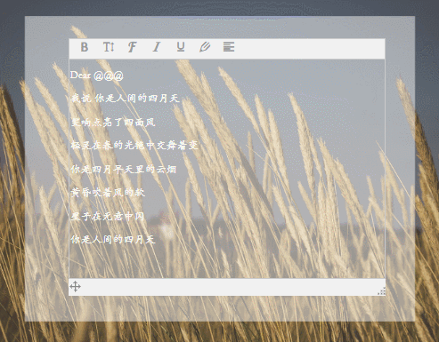

# 实现功能
实现富文本在定义区域内可以拖拽和调整大小，编辑完成后可将内容生成图片。
且系统较老旧，所以选择的是基于jQuery的插件。


# 相关插件
* [wangEditor](http://www.wangeditor.com/)
* [jQuery UI](https://jqueryui.com/)
* [html2canvas](https://html2canvas.hertzen.com/)

# 具体实现
原理其实是使用jQuery UI的Draggable和Resizable的特性实现富文本的拖拽和修改大小。
如果不需要jQuery UI的全部功能，可以只选择需要的功能进行下载，这样也能减少引入文件的大小。
将编辑好的内容生成图片是使用了html2canvas实现。

```html
<div id="preview">
    <div id="editor"></div>
</div>
```

```js
var E = window.wangEditor;
var editor = new E('#card');
editor.create();
        
$('#editor').append(`<div class="tool">
    <span class="move"></span>
    <embed class="move-svg" src="./move.svg"/>
    <embed class="resize" src="./resize.svg" style="float: right" />
</div>`);
        
$("#editor").draggable({ handle: '.move', containment: "#card" });
$("#editor").resizable({ containment: "#card" });
```

# 遇到的一些问题
1. 使用html2canvas生成图片时报错：“Uncaught (in promise) DOMException: Failed to execute 'toDataURL' on 'HTMLCanvasElement': Tainted canvases may not be exported.”
    除了网上说的一系列问题，比如图片的跨域处理之外，可能的原因是图片需要请求服务器得到，不能直接使用本地的图片。

# 参考
关于html2canvas生成图片的坑，这篇文章讲得很详细了：[一次 H5 「保存页面为图片」 的踩坑之旅](https://juejin.im/post/5a17c5e26fb9a04527254689)